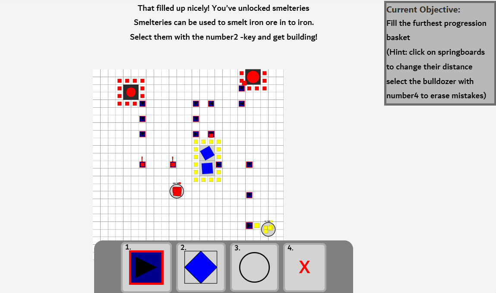

# Untitled Factory -game

A simple game created in ScalaFx for a course project.

## Start instructions

- Requirements:

  - [sbt](https://www.scala-sbt.org/)
  - [Scala - 2.13.14](https://www.scala-lang.org/)

- 3 options to start:
  - download the .jar file from the [releases](https://github.com/tinojdev/untitledfactory/releases/tag/release),
  - start with Scala metals or preferred IDE
  - or follow the Build instructions below

## Build instructions

1. In the root directory run `sbt`.
2. After initialized run `assembly` in the sbt shell.
3. The compiled .jar -file can be found in the `./target/scala-2.13` -folder
